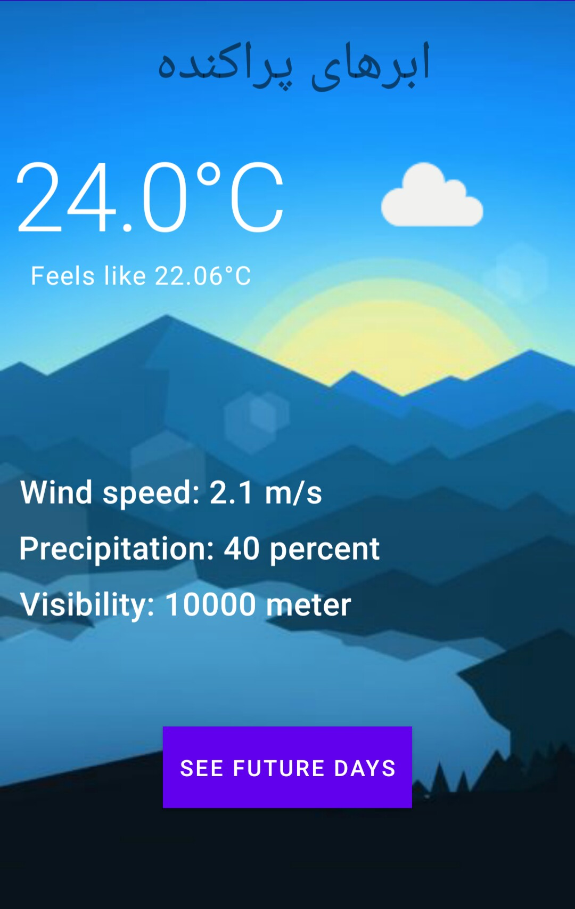

# Urman Open Weather

This is my test for interview with Urman Co.

This app, fetch weather data from openweathermap.org API.

Using:
- Kotlin
- MVVM architectural pattern
- lifecycle
- LiveData
- RecyclerView
- Retrofit
- Coroutine
- Navigation
- ROOM
- WorkManager

# Screenshot

